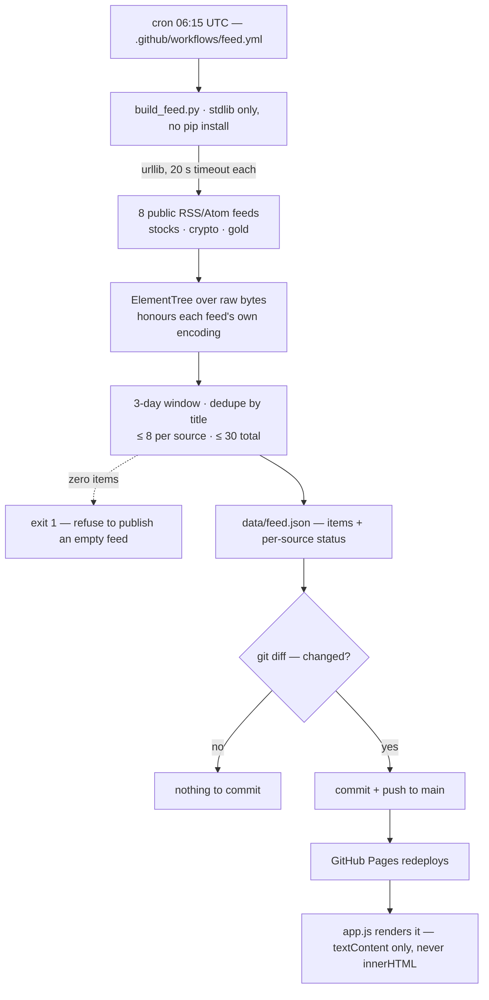

<p align="center"></p>

<p align="center">
  <b>The public front page of QuantFlex — a derivatives pricing and risk engine.<br>
  Move the sliders and it prices in your browser; scroll down and the tables are real engine output, hash by hash.</b>
</p>

<p align="center">
  <a href="https://chinmaygit8765.github.io/quantflex-site/"></a>
  <a href="https://github.com/ChinmayGit8765/quantflex-site/actions/workflows/feed.yml"></a>
  
  
  <a href="https://github.com/ChinmayGit8765/quantflex"></a>
  
</p>

This repo is **only the page and the data it renders**. The engine's public home is
[ChinmayGit8765/quantflex](https://github.com/ChinmayGit8765/quantflex) — a placeholder
while that app is built. The Monte Carlo, PDE solver, exotics and AAD Greeks are not
in this tree.

## ✨ What it does

- **Prices options in the visitor's browser.** Six sliders (spot, strike, vol, expiry, rate,
  dividend yield) plus call/put, and the price, five Greeks and the payoff curve recompute on
  every move — closed-form Black–Scholes, 132 lines of vanilla JS.
- **Reports its own error against the engine.** On load the page prices the engine's committed
  base case in the browser and prints the *measured* gap: right now `5.573526022256964` here
  against `5.573526022256971` from the engine — **a difference of 7.1e-15**, computed live, not
  typed in.
- **Shows five methods on one book.** Spot 100, strike 100, 20% vol, 5% rate, one year priced
  by closed form, Monte Carlo (262,144 paths), a Crank–Nicolson PDE, Merton jump-diffusion and
  Heston — each row carrying the `request_hash` that reproduces it.
- **Shows Greeks derived three independent ways.** A hand-written reverse-mode AAD tape, JAX,
  and central finite differences with common random numbers, side by side against a *measured*
  tolerance (1e-9 for delta, 3e-8 for vega) — all five agree.
- **Rebuilds a market feed every morning.** A cron'd GitHub Action collects up to 30 headlines
  from 8 public RSS/Atom feeds across stocks, crypto and gold, and commits `data/feed.json`
  only if it changed.
- **Ships with no build step and no dependencies.** Hand-written HTML, one stylesheet, two
  scripts, two JSON files; the only network calls the page makes are two same-origin fetches.

## 🎬 See it

<p align="center"></p>

<table><tr>
<td width="60%"><br><sub><b>Desktop</b> — the claim up front: built by hand, checked against an analytic anchor, Greeks derived three ways.</sub></td>
<td width="40%"><br><sub><b>Mobile</b> — same page, single column, no separate build.</sub></td>
</tr></table>

<table><tr>
<td width="50%"><br><sub><b>Try it</b> — sliders → price, delta/gamma/vega/theta/rho, and a payoff curve against value-at-expiry. All of it in the browser.</sub></td>
<td width="50%"><br><sub><b>Greeks, three ways</b> — AAD tape vs JAX vs finite differences, against a tolerance that was measured and then locked.</sub></td>
</tr></table>

<table><tr>
<td width="50%"><br><sub><b>One book, five methods</b> — prices, standard errors and 95% CIs from real engine calls, with the sampling-noise note spelled out.</sub></td>
<td width="50%"><br><sub><b>Monte Carlo convergence</b> — the ±1.96 SE band narrowing as 1/√N around the closed-form value, 64k → 1M paths.</sub></td>
</tr></table>

<table><tr>
<td><br><sub><b>Daily market feed</b> — filterable by stocks / crypto / gold, each card linking back to the publisher. Rewritten by CI at 06:15 UTC.</sub></td>
</tr></table>

## 🧠 How it works

The page is static. Everything interesting happens either *before* it is served (the engine
snapshot, the cron'd feed) or *in the visitor's browser* (the calculator). There is no backend
in this repo.

### The feed pipeline



Three decisions in there are load-bearing:

- **Stdlib only** (`urllib` + `xml.etree`). The workflow has no `pip install` step, so it holds
  no secrets, runs in seconds, and cannot break on somebody else's dependency release.
- **Bytes, not text.** `ElementTree` is handed the raw response so it honours each feed's own
  `<?xml encoding=...?>` declaration — several of these feeds are not UTF-8, and force-decoding
  corrupts punctuation into `U+FFFD`.
- **Asymmetric failure.** One dead or rate-limited feed degrades coverage and is reported under
  **Source health** on the page; a run in which *every* source fails exits non-zero rather than
  publishing an empty feed.

Feed titles and summaries are third-party strings, so the renderer builds every node with
`textContent` and links carry `rel="noopener noreferrer nofollow"` — nothing from a feed is ever
interpolated as HTML.

### What is real, and how often it moves

| On the page | Where the numbers come from | Refreshed |
| --- | --- | --- |
| **Try it** — price, Greeks, payoff curve | `assets/bs.js`, closed-form Black–Scholes running in your browser | on every slider move |
| The cross-check line under the calculator | computed at load: browser price vs the engine's price in `demo.json` | on every page load |
| **Live engine output** — five methods, Greeks, convergence, implied-vol round-trip | `data/demo.json` — real `price()` / `greeks()` calls in the private engine, each row hashed | only when the engine changes (currently engine `0.1.0`, generated 2026‑08‑24) |
| **Daily market feed** | `data/feed.json` — 8 public syndication feeds via `scripts/build_feed.py` | 06:15 UTC daily, committed by CI if it changed |
| **Where it stands** roadmap | hand-written in `index.html` | by hand |

`data/demo.json` is a committed snapshot on purpose, not a scheduled job: the engine is
deterministic under fixed seeds, so the numbers only change when the engine changes. There is
nothing to refresh daily, and therefore no cross-repo credential to manage. It is produced by
`scripts/build_site_demo.py` in the private engine repo; regenerate it by running that script
and copying the result here. Every figure comes from a real engine call and nothing is
hand-typed.

<details>
<summary><b>Provenance the page publishes for the engine snapshot</b></summary>

Under *Live engine output → Provenance*, the page prints what produced the numbers:
engine `0.1.0`, Python `3.13.7`, NumPy `2.4.6`, the platform string, kernel fingerprints for
`exp` / `log` / `ndtr` / `erf`, and the first 12 hex of each row's request hash
(`european-analytic aba62526c8da…`, `european-mc 78fb2b3ace02…`, `american-pde 421281628658…`,
`merton-mc 8d9311e3e627…`, `heston-qe 0467efa08503…`).

The convergence series is seeded (`20260611`) and runs 65,536 → 1,048,576 paths; the
implied-vol round-trip recovers σ = 0.2 and reprices to the original 10.450584 with zero
absolute error in both directions.
</details>

## 📐 Keeping the browser preview honest

`assets/bs.js` is a *second* implementation of maths the engine already owns, which is normally
worth avoiding. It exists because a static page cannot call the Python engine, and a preview a
visitor can actually move is worth more than another table of frozen numbers.

It is held honest rather than trusted:

- The page prices the engine's committed base case in the browser on load and reports the
  **measured** difference against the engine's own value — currently **`7.1e-15`**. If this file
  ever drifts, the badge says so instead of quietly showing wrong numbers.
- Independently verified before shipping: put–call parity holds to `4.3e-14` relative across
  **20,000 random parameter sets**, `N(x) + N(-x) - 1` is exactly zero, and the call price is
  monotonic in volatility.
- The normal CDF is **Hart's rational approximation** (as given in West 2005) rather than
  Abramowitz–Stegun 7.1.26, which is only good to ~`1e-7` and would be visible in that
  cross-check.

Scope is deliberately narrow: **closed-form European vanillas under GBM**. Monte Carlo, the PDE
solver, exotics and the AAD Greeks stay server-side in the real engine — that is what
"coming soon" refers to.

## 🚀 Quick start

```sh
git clone https://github.com/ChinmayGit8765/quantflex-site
cd quantflex-site

python scripts/build_feed.py --out data/feed.json   # optional: refresh the headlines
python -m http.server 8000                          # then open http://localhost:8000
```

A plain `file://` open will not work — the page fetches the two JSON payloads, which browsers
block from the filesystem. No `npm install`, no bundler, no Python packages: the collector is
stdlib-only.

## 🗂️ Project layout

```
index.html                    the whole page — four sections, no framework
assets/
  style.css                   design tokens shared with the main app
  bs.js                       closed-form Black–Scholes for the browser preview (132 lines)
  app.js                      calculator, hand-drawn SVG charts, renderers for both payloads
data/
  demo.json                   engine output — committed snapshot, engine 0.1.0
  feed.json                   headlines — rewritten daily by the scheduled job
scripts/build_feed.py         stdlib-only RSS/Atom collector (233 lines)
.github/workflows/feed.yml    06:15 UTC cron → collect → commit only if changed
docs/assets/                  README banner, screenshots and scroll GIF
```

## 🧰 Stack

| Layer | Choice | Why |
| --- | --- | --- |
| Page | Hand-written HTML + one stylesheet | GitHub Pages serves the repo as-is; nothing to build, nothing to break |
| Interactivity | ~670 lines of vanilla JS, zero dependencies | The only network calls are two same-origin `fetch`es |
| Pricing preview | `bs.js` — closed-form Black–Scholes, Hart/West normal CDF | Double-precision accuracy the self-check can actually verify |
| Charts | Inline SVG built with `createElementNS` in `app.js` | No chart library to ship, and each chart carries its own `aria-label` |
| Feed collector | Python 3.13 stdlib (`urllib` + `xml.etree`) | No `pip install` in CI, no secrets, immune to dependency releases |
| Automation | GitHub Actions cron, `contents: write`, commit-if-changed | The only write permission this repo needs |
| Hosting | GitHub Pages on `main` | Static output, zero infrastructure |
| Engine (elsewhere) | Python + NumPy, JAX for the Greeks cross-check | Kept private; this page renders its committed output |

## 🗺️ Status & roadmap

The page itself is live and does what it says. The status below is the **engine's**, mirrored
from the *Where it stands* section of the page:

- ✅ **Engine core** — closed-form Black–Scholes, chunked Monte Carlo with standard errors,
  implied-vol solver, reproducible seeded draws
- ✅ **Greeks** — hand-rolled AAD tape cross-verified against JAX and finite differences, with a
  payoff-smoothness registry
- ✅ **Model breadth** — Merton jump-diffusion and Heston stochastic volatility, anchored on
  characteristic-function references
- ✅ **American options** — Crank–Nicolson PDE with Rannacher startup, cross-checked against a
  Longstaff–Schwartz bias sandwich
- ✅ **Exotics & baskets** — Asian, barrier and lookback payoffs, variance reduction, correlated
  multi-asset baskets
- 🚧 **Public API & web app** — pricing endpoints and the browser front end, in progress. This
  page is the preview of it.
- 🔜 **Portfolios & risk** — VaR/CVaR with component risk decomposition

Watch [ChinmayGit8765/quantflex](https://github.com/ChinmayGit8765/quantflex) for the engine
release.

## ⚠️ Not financial advice

QuantFlex is an engineering and mathematics project. Nothing here is a recommendation to buy or
sell any instrument, and the market headlines are third-party links reproduced from public
syndication feeds.

## 📄 License

No `LICENSE` file yet, so default copyright applies. Open an issue if you want to reuse a piece
of it.

<p align="center"><sub>Built by <a href="https://github.com/ChinmayGit8765">Chinmay</a> · part of the <a href="https://chinmaygit8765.github.io/exaryn-studio/">Exaryn</a> studio</sub></p>
