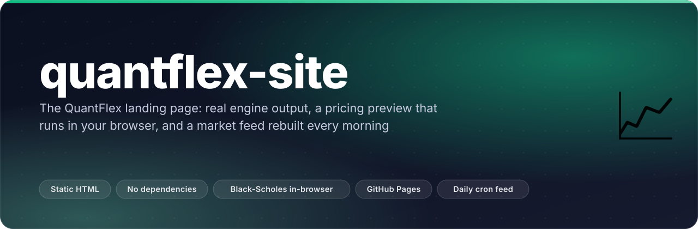
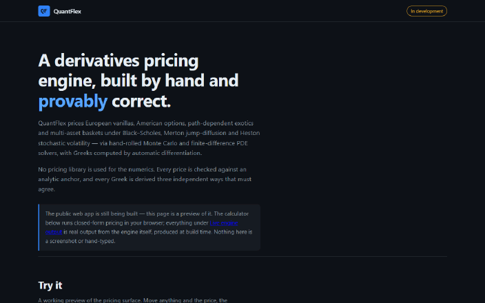
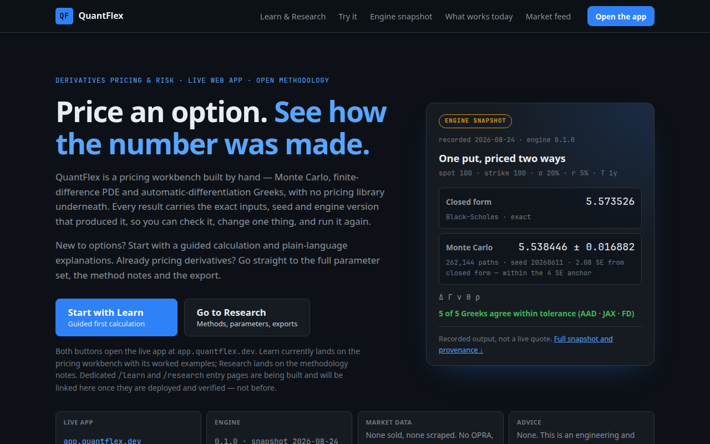
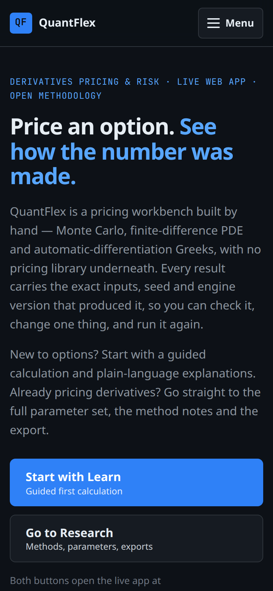
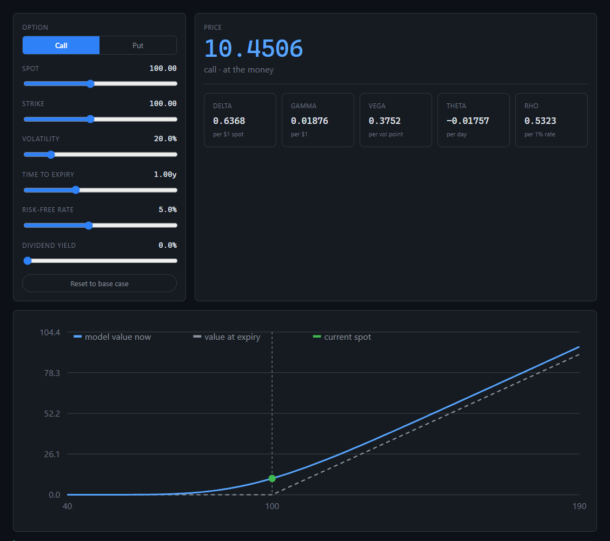
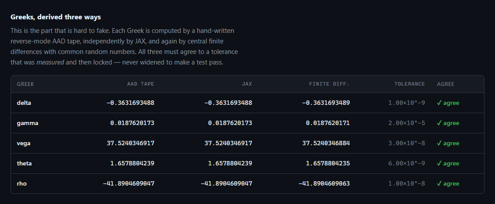
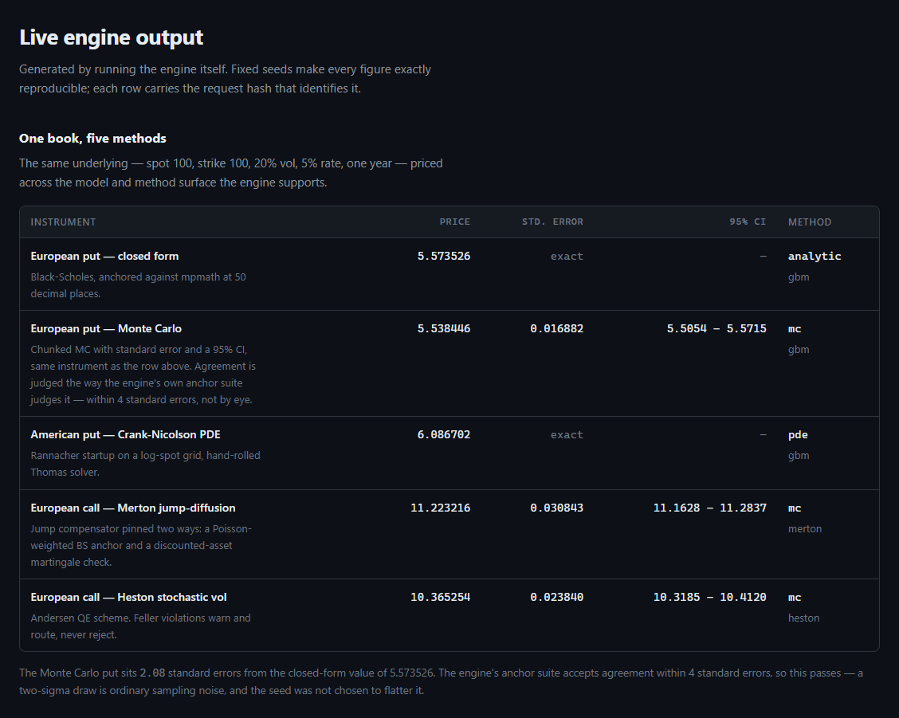
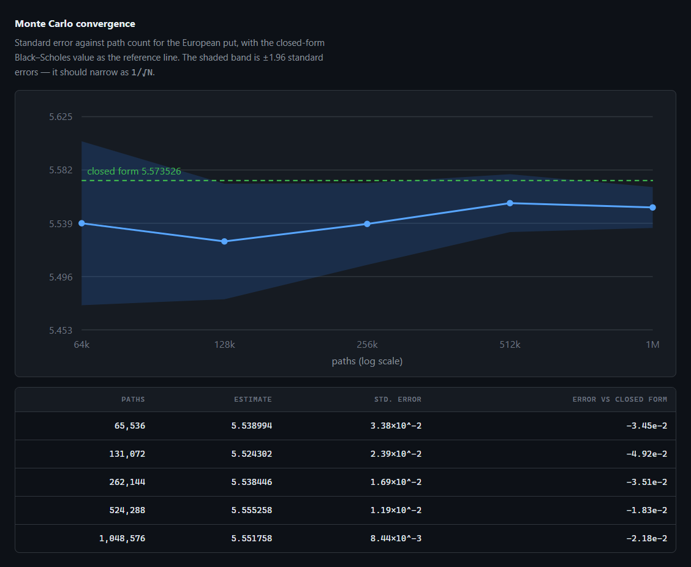
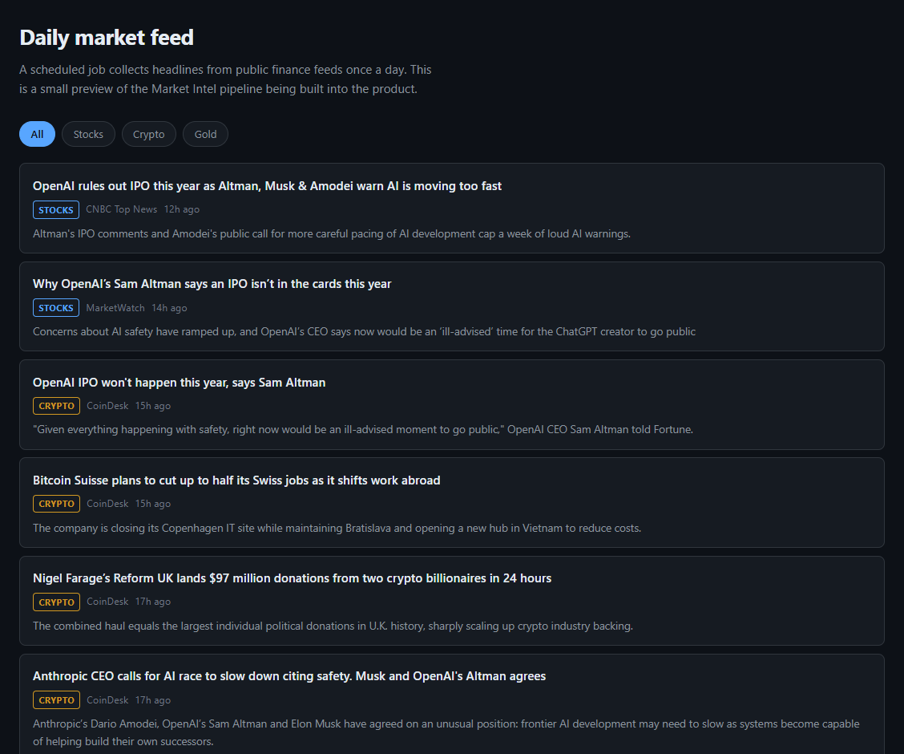
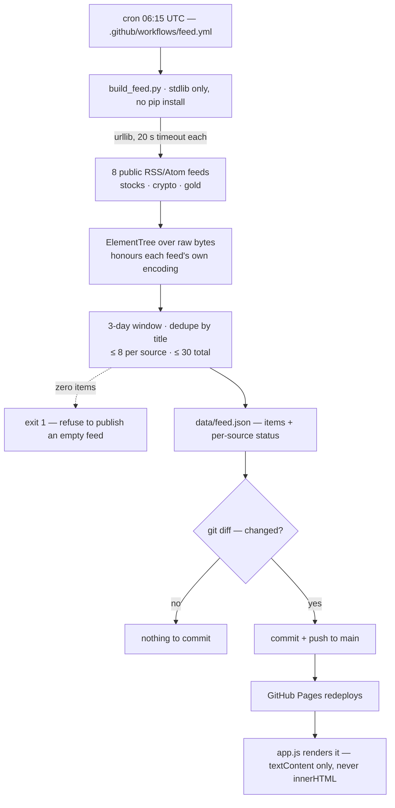

<p align="center"></p>

<p align="center">
  <b>The public front page of QuantFlex — a derivatives pricing and risk workbench.<br>
  Two ways in (Learn for newcomers, Research for practitioners), a calculator that prices in your browser,
  a labelled engine snapshot, an honest capability inventory, and a market feed rebuilt every morning.</b>
</p>

<p align="center">
  <a href="https://chinmaygit8765.github.io/quantflex-site/"></a>
  <a href="https://github.com/ChinmayGit8765/quantflex-site/actions/workflows/feed.yml"></a>
  
  
  <a href="https://github.com/ChinmayGit8765/quantflex"></a>
  
</p>

This repo is **only the landing page and the data it renders**. The product itself is the
live web app at [app.quantflex.dev](https://app.quantflex.dev/) with its API at
[api.quantflex.dev](https://api.quantflex.dev/docs); the engine's public home is
[ChinmayGit8765/quantflex](https://github.com/ChinmayGit8765/quantflex). The Monte Carlo,
PDE solver, exotics and AAD Greeks are not in this tree — this page renders a committed
snapshot of their output and links to where they run.

## ✨ What it does

- **Gives two distinct ways in.** *Learn* for newcomers (a guided first calculation, plain-language
  notes, change one input, keep the result) and *Research* for practitioners (methods, models,
  Greeks with the cross-check shown, reproducible CSV/JSON export, API). Both CTAs point at
  routes that exist in the deployed app today (`/` and `/methodology`); the dedicated `/learn`
  and `/research` entry pages are linked only once they are deployed and verified.
- **Says what works and what doesn't.** *What works today* lists what is in the live app now.
  *Coming soon* — Excel workbook download, live Excel refresh, platform-specific code export,
  daily strategy simulations, the strategy-brief assistant, portfolios & risk — is labelled, not
  clickable, and promises no dates.
- **Prices options in the visitor's browser.** Six sliders (spot, strike, vol, expiry, rate,
  dividend yield) plus call/put, and the price, five Greeks and the payoff curve recompute on
  every move — closed-form Black–Scholes, 132 lines of vanilla JS — with a plain-language
  glossary and the Black–Scholes assumptions spelled out underneath.
- **Reports its own error against the engine.** On load the page prices the engine's committed
  base case in the browser and prints the *measured* gap: right now `5.573526022256964` here
  against `5.573526022256971` from the engine — **a difference of 7.1e-15**, computed live, not
  typed in.
- **Shows five methods on one book — labelled as a snapshot.** Spot 100, strike 100, 20% vol,
  5% rate, one year priced by closed form, Monte Carlo (262,144 paths), a Crank–Nicolson PDE,
  Merton jump-diffusion and Heston — each row carrying the `request_hash` that reproduces it.
  A provenance label above the tables states the source, the recording date, the engine version
  and the parameters, so the figures cannot be mistaken for live quotes.
- **Shows Greeks with the cross-check visible.** A hand-written reverse-mode AAD tape, central
  finite differences with common random numbers and — on the machine that produced the
  snapshot — JAX, side by side against a *measured* tolerance (1e-9 for delta, 3e-8 for vega).
  A summary line says how many agree and how many ways each was checked; a disagreeing row is
  highlighted, never hidden. The live API verifies AAD against finite differences (its JAX
  column is `n/a`), and the page says so rather than claiming universal triple verification.
- **Rebuilds a market feed every morning.** A cron'd GitHub Action collects up to 30 headlines
  from 8 public RSS/Atom feeds across stocks, crypto and gold, and commits `data/feed.json`
  only if it changed.
- **Ships with no build step and no dependencies.** Hand-written HTML, one stylesheet, two
  scripts, two JSON files; the only network calls the page makes are two same-origin fetches.
- **Works for everyone.** Skip link, landmark regions, labelled controls, `aria-pressed` toggles,
  a keyboard-operable mobile menu (Escape closes it), visible focus rings, and smooth scrolling
  only when the visitor has not asked for reduced motion. Checked at 390px and desktop.

## 🎬 See it

<p align="center"></p>

<table><tr>
<td width="60%"><br><sub><b>Desktop</b> — two ways in, and one put priced two ways from the labelled snapshot, with the Greeks agreement count.</sub></td>
<td width="40%"><br><sub><b>Mobile (390px)</b> — same page, single column, keyboard-operable menu, no separate build.</sub></td>
</tr></table>

<table><tr>
<td width="50%"><br><sub><b>Try it</b> — sliders → price, delta/gamma/vega/theta/rho, and a payoff curve against value-at-expiry. All of it in the browser.</sub></td>
<td width="50%"><br><sub><b>Greeks, three ways</b> — AAD tape vs JAX vs finite differences, against a tolerance that was measured and then locked.</sub></td>
</tr></table>

<table><tr>
<td width="50%"><br><sub><b>One book, five methods</b> — prices, standard errors and 95% CIs from real engine calls, with the sampling-noise note spelled out.</sub></td>
<td width="50%"><br><sub><b>Monte Carlo convergence</b> — the ±1.96 SE band narrowing as 1/√N around the closed-form value, 64k → 1M paths.</sub></td>
</tr></table>

<table><tr>
<td><br><sub><b>Daily market feed</b> — filterable by stocks / crypto / gold, each card linking back to the publisher. Rewritten by CI at 06:15 UTC.</sub></td>
</tr></table>

## 🧠 How it works

The page is static. Everything interesting happens either *before* it is served (the engine
snapshot, the cron'd feed) or *in the visitor's browser* (the calculator). There is no backend
in this repo.

### The feed pipeline



Three decisions in there are load-bearing:

- **Stdlib only** (`urllib` + `xml.etree`). The workflow has no `pip install` step, so it holds
  no secrets, runs in seconds, and cannot break on somebody else's dependency release.
- **Bytes, not text.** `ElementTree` is handed the raw response so it honours each feed's own
  `<?xml encoding=...?>` declaration — several of these feeds are not UTF-8, and force-decoding
  corrupts punctuation into `U+FFFD`.
- **Asymmetric failure.** One dead or rate-limited feed degrades coverage and is reported under
  **Source health** on the page; a run in which *every* source fails exits non-zero rather than
  publishing an empty feed.

Feed titles and summaries are third-party strings, so the renderer builds every node with
`textContent` and links carry `rel="noopener noreferrer nofollow"` — nothing from a feed is ever
interpolated as HTML.

### What is real, and how often it moves

| On the page | Where the numbers come from | Refreshed |
| --- | --- | --- |
| **Try it** — price, Greeks, payoff curve | `assets/bs.js`, closed-form Black–Scholes running in your browser | on every slider move |
| The cross-check line under the calculator | computed at load: browser price vs the engine's price in `demo.json` | on every page load |
| **Hero snapshot card** — one put by closed form and Monte Carlo, Greeks agreement count | `data/demo.json`, labelled with its recording date and engine version | only when the engine changes |
| **Engine snapshot** — five methods, Greeks, convergence, implied-vol round-trip | `data/demo.json` — real `price()` / `greeks()` calls in the engine, each row hashed | only when the engine changes (currently engine `0.1.0`, generated 2026‑08‑24) |
| **Daily market feed** | `data/feed.json` — 8 public syndication feeds via `scripts/build_feed.py` | 06:15 UTC daily, committed by CI if it changed |
| **What works today / Coming soon** inventory | hand-written in `index.html`, checked against the deployed app's routes and the API's OpenAPI schema | by hand |

`data/demo.json` is a committed snapshot on purpose, not a scheduled job: the engine is
deterministic under fixed seeds, so the numbers only change when the engine changes. There is
nothing to refresh daily, and therefore no cross-repo credential to manage. It is produced by
`scripts/build_site_demo.py` in the engine repo; regenerate it by running that script and
copying the result here. Every figure comes from a real engine call and nothing is hand-typed,
and the page labels it as a recorded snapshot — never as live output.

<details>
<summary><b>Provenance the page publishes for the engine snapshot</b></summary>

Under *Engine snapshot → Provenance*, the page prints what produced the numbers:
engine `0.1.0`, Python `3.13.7`, NumPy `2.4.6`, the platform string, kernel fingerprints for
`exp` / `log` / `ndtr` / `erf`, and the first 12 hex of each row's request hash
(`european-analytic aba62526c8da…`, `european-mc 78fb2b3ace02…`, `american-pde 421281628658…`,
`merton-mc 8d9311e3e627…`, `heston-qe 0467efa08503…`).

The convergence series is seeded (`20260611`) and runs 65,536 → 1,048,576 paths; the
implied-vol round-trip recovers σ = 0.2 and reprices to the original 10.450584 with zero
absolute error in both directions.
</details>

## 📐 Keeping the browser preview honest

`assets/bs.js` is a *second* implementation of maths the engine already owns, which is normally
worth avoiding. It exists because a static page cannot call the Python engine, and a preview a
visitor can actually move is worth more than another table of frozen numbers.

It is held honest rather than trusted:

- The page prices the engine's committed base case in the browser on load and reports the
  **measured** difference against the engine's own value — currently **`7.1e-15`**. If this file
  ever drifts, the badge says so instead of quietly showing wrong numbers.
- Independently verified before shipping: put–call parity holds to `4.3e-14` relative across
  **20,000 random parameter sets**, `N(x) + N(-x) - 1` is exactly zero, and the call price is
  monotonic in volatility.
- The normal CDF is **Hart's rational approximation** (as given in West 2005) rather than
  Abramowitz–Stegun 7.1.26, which is only good to ~`1e-7` and would be visible in that
  cross-check.

Scope is deliberately narrow: **closed-form European vanillas under GBM**. Monte Carlo, the PDE
solver, exotics and the AAD Greeks stay server-side in the engine, which the live app calls
over HTTP.

## 🚀 Quick start

```sh
git clone https://github.com/ChinmayGit8765/quantflex-site
cd quantflex-site

python scripts/build_feed.py --out data/feed.json   # optional: refresh the headlines
python -m http.server 8000                          # then open http://localhost:8000
```

A plain `file://` open will not work — the page fetches the two JSON payloads, which browsers
block from the filesystem. No `npm install`, no bundler, no Python packages: the collector is
stdlib-only.

## 🗂️ Project layout

```
index.html                    the whole page — hero, Learn/Research paths, Try it, Engine snapshot,
                              What works today / Coming soon, Daily market feed — no framework
assets/
  style.css                   design tokens shared with the main app
  bs.js                       closed-form Black–Scholes for the browser preview (132 lines)
  app.js                      calculator, hand-drawn SVG charts, renderers for both payloads
data/
  demo.json                   engine output — committed snapshot, engine 0.1.0
  feed.json                   headlines — rewritten daily by the scheduled job
scripts/build_feed.py         stdlib-only RSS/Atom collector (233 lines)
.github/workflows/feed.yml    06:15 UTC cron → collect → commit only if changed
docs/assets/                  README banner, screenshots and scroll GIF
```

## 🧰 Stack

| Layer | Choice | Why |
| --- | --- | --- |
| Page | Hand-written HTML + one stylesheet | GitHub Pages serves the repo as-is; nothing to build, nothing to break |
| Interactivity | ~670 lines of vanilla JS, zero dependencies | The only network calls are two same-origin `fetch`es |
| Pricing preview | `bs.js` — closed-form Black–Scholes, Hart/West normal CDF | Double-precision accuracy the self-check can actually verify |
| Charts | Inline SVG built with `createElementNS` in `app.js` | No chart library to ship, and each chart carries its own `aria-label` |
| Feed collector | Python 3.13 stdlib (`urllib` + `xml.etree`) | No `pip install` in CI, no secrets, immune to dependency releases |
| Automation | GitHub Actions cron, `contents: write`, commit-if-changed | The only write permission this repo needs |
| Hosting | GitHub Pages on `main` | Static output, zero infrastructure |
| Engine (elsewhere) | Python + NumPy on Cloud Run; JAX available for the Greeks cross-check where installed | Runs behind the live app and API; this page renders a committed snapshot of its output |

## 🗺️ Status

The page is live and does what it says. The capability inventory it publishes (*What works
today / Coming soon*) is the source of truth for product status and is kept in step with the
deployed app and API:

- **In the app today** — pricing workbench (closed form, Monte Carlo, PDE, Longstaff–Schwartz
  across GBM, Merton and Heston; European/American exercise; Asian, barrier, lookback, basket
  and spread payoffs), Greeks panel with the finite-difference cross-check, CSV/JSON export and
  copyable links, Methodology, Roadmap, Market Intel, Daily Rundown, Planner, and the HTTP API
  (`/price`, `/greeks`, `/price/grid`) documented with OpenAPI.
- **Coming soon, labelled as such** — dedicated Learn and Research entry pages, Excel workbook
  download, live Excel refresh, platform-specific code export, daily strategy simulations, the
  strategy-brief assistant, portfolios & risk. None of these is presented as a working control
  and no dates are promised.

When the app's `/learn` and `/research` routes are deployed and verified, the two hero CTAs and
the two path-card buttons in `index.html` are the only hrefs to swap (see the comment above the
hero CTAs).

## ⚠️ Not financial advice

QuantFlex is an engineering and mathematics project. Nothing here is a recommendation to buy or
sell any instrument, and the market headlines are third-party links reproduced from public
syndication feeds. QuantFlex does not buy, sell or redistribute market data — no OPRA, no
options-flow feeds.

## 📄 License

No `LICENSE` file yet, so default copyright applies. Open an issue if you want to reuse a piece
of it.

<p align="center"><sub>Built by <a href="https://github.com/ChinmayGit8765">Chinmay</a> · part of the <a href="https://chinmaygit8765.github.io/exaryn-studio/">Exaryn</a> studio</sub></p>
